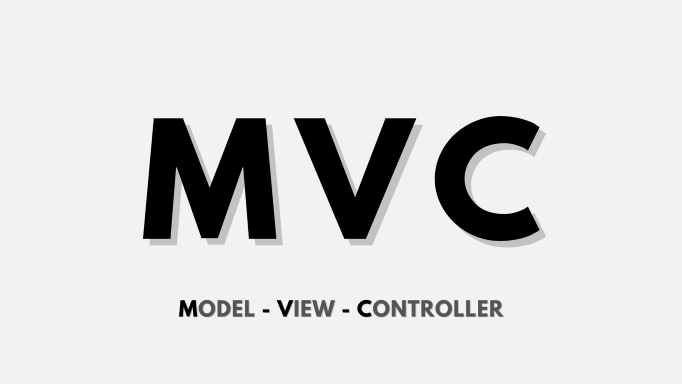

# 浅析 MVC



## MVC

MVC包括三类对象，将它们分离以提高灵活性和复用性。

- 模型（Model）用于封装与应用程序的业务逻辑相关的数据以及对数据的处理方法，会有一个或多个视图监听此模型。一旦模型的数据发生变化，模型将通知有关的视图。
- 视图（View）是它在屏幕上的表示，描绘的是 Model 的当前状态。当模型的数据发生变化，视图相应地得到刷新自己的机会。
- 控制器（Controller）定义用户界面对用户输入的响应方式，起到不同层面间的组织作用，用于控制应用程序的流程，他处理用户的行为和数据 Model 上的改变。

示例：

Model.js

```javascript
import EventBus from "../EventBus"

class Model extends EventBus {
  constructor(options) {
    super()
    const key = ['data', 'update', 'create', 'delete', 'get']
    key.forEach((key) => {
      if (key in options) {
        this[key] = options[key]
      }
    })
  }

  create() {
    console && console.error && console.error("你还没有实现 create")
  }

  delete() {
    console && console.error && console.error("你还没有实现 delete")
  }

  update() {
    console && console.error && console.error("你还没有实现 update")
  }

  get() {
    console && console.error && console.error("你还没有实现 get")
  }
}

export default Model
```

View.js(v 中包含了 c)

```javascript
import $ from 'jquery'
import EventBus from "../EventBus";

class View extends EventBus {
  constructor(options) {
    super();
    Object.assign(this, options)
    this.el = $(this.el)
    this.render(this.data)
    this.autoBindEvents()
    this.on('updated', () => {
      this.render(this.data)
    })
  }

  autoBindEvents() {
    for (let key in this.events) {
      const value = this[this.events[key]]
      const spaceIndex = key.indexOf(' ')
      const part1 = key.slice(0, spaceIndex)
      const part2 = key.slice(spaceIndex + 1)
      this.el.on(part1, part2, value)

    }
  }
}

export default View
```

MVC 的一个实例:

```javascript
import $ from "jquery";
import View from "./base/View";
import Model from "./base/Model";

const m = new Model({
  data: {},
  update: function (data) {
    Object.assign(this.data, data)
    this.trigger('updated')
  }
});

const init = (el) => {
  new View({
    data: m.data,
    el: el,
    html: ``,
    render: function (data) {
      if (this.el.children.length !== 0) {
        this.el.empty()
      }
      $(this.html).appendTo(this.el)
    },
    events: {},
    add() {
      m.update()
    },
    minus() {
      m.update()
    }
    // ...
  })
}


export default init
```

## EventBus

把所有的对象看成点，一个点和一个点怎么通信；一个点和多个点怎么通信；多个点和多个点怎么通信，最终我们找出一个专用的点负责通信，这个点就是 Event Bus。

trigger: 根据绑定到匹配元素的给定事件类型执行所有的处理程序和行为。

on: 在选定的元素上绑定一个或多个事件处理函数。

off: 移除一个事件处理函数。

```javascript
import $ from 'jquery'

class EventBus {
  constructor() {
    this._eventBus = $(window)
  }

  on(eventName, fn) {
    return this._eventBus.on(eventName, fn)
  }

  trigger(eventName, data) {
    return this._eventBus.trigger(eventName, data)
  }

  off(eventName, fn) {
    return this._eventBus.off(eventName, fn)
  }
}

export default EventBus
```

## 表驱动法

表驱动法是一种编程模式（scheme）——从表里面查找信息而不使用逻辑语句（if 和
case）。事实上，凡是能通过逻辑语句来选择的事物，都可以通过查表来选择。对简单的情况而言，使用逻辑语句更为容易和直白。但随着逻辑链的越来越复杂，查表法也就愈发显得更具吸引力。

表提供了一种复杂的逻辑和继承结构的替换方案。如果发现自己对某个应用程序的逻辑或者继承树关系感到困惑，那么应该问问自己它是否可以通过一个查询表来加以简化。

使用表的一项关键决策是决定如何去访问表。可以采取直接访问、索引访问或者阶梯访问。

使用表的另一项关键决策是决定应该把什么内容放入表中。

> 参考 [Code Complete 2](http://aroma.vn/web/wp-content/uploads/2016/11/code-complete-2nd-edition-v413hav.pdf)

## 模块化

模块（Module）化，可以将一个大程序拆分成互相依赖的小文件，再用简单的方法将他们拼装起来。模块化为最小知识原则奠定了基础，同时也付出了一定的代价，比如：会使得页面一开始是空白的，没内容没样式。

ES6 模块，通过 export 命令显式指定输出的代码，再通过 import 命令输入。

```javascript
// ES6 模块
import {stat, exists, readFile} from 'fs'
```

上面的代码的实质是从 fs 模块加载 3 个方法，其他方法不加载。