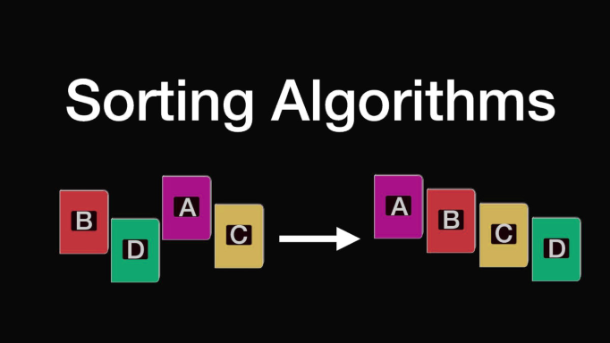

# 排序算法



## 选择排序（Selection sort）

**思路：** 每次找到最小的数放前面，然后对后面的数做同样的事情。

```jsx
let sort = (numbers) => {
  for (let i = 0; i < numbers.length - 1; i++) {
    let index = minIndex(numbers.slice(i)) + i
    if (index !== i) {
      swap(numbers, index, i)
    }
  }
  return numbers
}

let swap = (array, i, j) => {
  array[i] ^= array[j]
  array[j] ^= array[i]
  array[i] ^= array[j]
}
let minIndex = (numbers) => {
  let index = 0
  for (let i = 1; i < numbers.length; i++) {
    if (numbers[i] < numbers[index]) {
      index = i
    }
  }
  return index
}
```

## 快速排序（QuickSort）

**思路：**

1. 在数据集中，选择一个元素作为“基准”（pivot)。
2. 所有小于“基准”的元素，都移到“基准”的左边；所有大于“基准”的元素，都移到“基准”的右边
3. 对“基准”左边和右边的两个子集，不断重复第一步和第二步，直到所有子集只剩下一个元素为止。

```jsx
let quickSort = arr => {
  if (arr.length <= 1) {
    return arr
  }
  let pivotIndex = Math.floor(arr.length / 2)
  let pivot = arr.splice(pivotIndex, 1)[0]
  let left = []
  let right = []
  for (let i = 0; i < arr.length; i++) {
    if (arr[i] < pivot) {
      left.push(arr[i])
    } else {
      right.push(arr[i])
    }
  }
  return quickSort(left).concat([pivot], quickSort(right));
}
```

---

另一种写法

```jsx
function swap(items, leftIndex, rightIndex) {
  let temp = items[leftIndex];
  items[leftIndex] = items[rightIndex];
  items[rightIndex] = temp;
}

function partition(items, left, right) {
  let pivot = items[Math.floor((right + left) / 2)],
    i = left,
    j = right;
  while (i <= j) {
    while (items[i] < pivot) {
      i++;
    }
    while (items[j] > pivot) {
      j--;
    }
    if (i <= j) {
      swap(items, i, j);
      i++;
      j--;
    }
  }
  return i;
}

function quickSort(items, left, right) {
  let index;
  if (items.length > 1) {
    index = partition(items, left, right);
    if (left < index - 1) {
      quickSort(items, left, index - 1);
    }
    if (index < right) {
      quickSort(items, index, right);
    }
  }
  return items;
}
```

## 并归排序（Merge sort）

**思路：**

1. 将未排序的列表划分为 n 个子列表，每个子列表只包含一个元素（一个元素的列表被视为已排序的）
2. 重复合并子列表以生成新的已排序子列表，直到只剩下一个子列表。这将是最终的排序列表。

```jsx
let mergeSort = arr => {
  let k = arr.length
  if (k <= 1) {
    return arr
  }
  let left = arr.slice(0, Math.floor(k / 2))
  let right = arr.slice(Math.floor(k / 2))
  return merge(mergeSort(left), mergeSort(right))
}
let merge = (a, b) => {
  if (a.length === 0) return b
  if (b.length === 0) return a
  return a[0] > b[0] ?
    [b[0]].concat(merge(a, b.slice(1))) :
    [a[0]].concat(merge(a.slice(1), b))
}
```

## 计数排序（Counting sort）

**思路：** 用一个哈希表作记录，发现数字 N 就 N: 1，如果再次发现 N 就加 1，最后把哈希表的 key 全部打出来，假设 N: m，那么 N 需要打印 m 次。

```jsx
let countSort = arr => {
  let hashTable = {},
    max = 0,
    result = []
  for (let i = 0; i < arr.length; i++) {
    // 遍历数组
    if (!(arr[i] in hashTable)) {
      hashTable[arr[i]] = 1
    } else {
      hashTable[arr[i]] += 1
    }
    if (arr[i] > max) {
      max = arr[i]
    }
  }
  for (let j = 0; j <= max; j++) {
    // 遍历哈希表
    if (j in hashTable) {
      for (let i = 0; i < hashTable[j]; i++) {
        result.push(j)
      }
    }
  }
  return result
}
```

计数排序的特点：数据结构不同，使用了额外的 hashTable，只遍历数组一遍（不过还要遍历一次 hashTable）这叫做“用空间换时间”。

## 冒泡排序（Bubble sort）

**思路：** 从列表的开头开始，比较每个相邻的对，如果它们的顺序不正确（后者小于前者），则交换它们的位置。在每次迭代之后，需要比较的元素就少一个（最后一个），直到没有更多的元素需要比较。

```jsx
function bubbleSort(arr) {
  for (let i = 0; i < arr.length - 1; i++) {
    for (let j = 0; j < arr.length - i - 1; j++) {
      if (arr[j] > arr[j + 1]) {
        [arr[j], arr[j + 1]] = [arr[j + 1], arr[j]];
      }
    }
  }
  return arr;
}
```

## 插入排序（Insertion sort）

**思路：** 将数组分成“已排序”和“未排序”两部分，一开始的时候“已排序”的部分只有一个元素，然后将它后面一个元素从“未排序”部分插入“已排序”部分，从而“已排序”部分增加一个元素，“未排序”部分减少一个元素。以此类推，完成全部排序。

```jsx
function insertionSort(arr) {
  let n = arr.length;
  for (let i = 1; i < n; i++) {
    let current = arr[i];
    let j = i;
    while (--j > -1 && arr[j] > current) {
      arr[j + 1] = arr[j];
    }
    arr[j + 1] = current;
  }
  return arr;
}
```

## 希尔排序（Shell sort）

**思路：** 该方法首先对彼此相距很远的元素对进行排序，然后逐渐减小要比较的元素之间的差距。

```jsx
function shellSort(arr) {
  for (let gap = arr.length >> 1; gap > 0; gap >>= 1) {
    for (let i = gap; i < arr.length; i++) {
      let temp = arr[i],
        j;
      for (j = i - gap; j >= 0 && arr[j] > temp; j -= gap) {
        arr[j + gap] = arr[j];
      }
      arr[j + gap] = temp;
    }
  }
  return arr;
}
```

## 基数排序（Radix sort）

**思路：** 从最低有效位到最高有效位进行逐位排序。基数排序使用计数排序作为子程序。

```jsx
function getDigit(num, place) {
  return Math.floor(Math.abs(num) / Math.pow(10, place)) % 10
}

function digitCount(num) {
  if (num === 0) return 1
  return Math.floor(Math.log10(Math.abs(num))) + 1
}

function mostDigits(nums) {
  let maxDigit = 0
  for (let i = 0; i < nums.length; i++) {
    maxDigit = Math.max(maxDigit, digitCount(nums[i]))
  }
  return maxDigit
}

function radixSort(arrOfNums) {
  const maxDigitCount = mostDigits(arrOfNums)
  for (let k = 0; k < maxDigitCount; k++) {
    let digitBuckets = Array.from({length: 10}, () => []) // [[], [], [],...]
    for (let i = 0; i < arrOfNums.length; i++) {
      let digit = getDigit(arrOfNums[i], k)
      digitBuckets[digit].push(arrOfNums[i])
    }
    // New order after each loop
    arrOfNums = [].concat(...digitBuckets)
  }
  return arrOfNums
}
```

## 时间复杂度对比

选择排序：O(n<sup>2</sup>)

快速排序：O(nlog<sub>2</sub>n)

并归排序：O(nlog<sub>2</sub>n)

计数排序：O(n+max)

冒泡排序：O(n<sup>2</sup>)

插入排序：O(n<sup>2</sup>)

希尔排序：O(n<sup>3/2</sup>)

基数排序：O(nk)