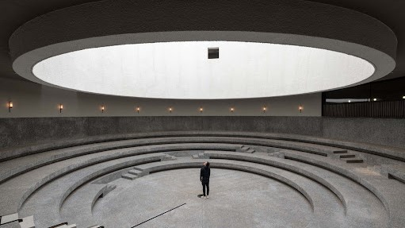

# CSS 动画指北



## 动画的原理

由许多静止的画面（帧）以一定的速度（如每秒 30 张）连续播放时，肉眼因视觉残像产生错觉，而误以为时活动的画面。

- 帧：每个静止的画面都叫做帧
- 播放速度：每秒 24 帧（影视）或者每秒 30 帧（游戏）

## 浏览器的渲染过程

1. 根据 HTML 构建 HTML 树（DOM）
2. 根据 CSS 构建 CSS 树（CSSOM）
3. 将两棵树合并成一颗渲染树（render tree）
4. Layout 布局（文档流、盒模型、计算大小和位置）
5. Paint 绘制（把边框颜色、文字颜色、阴影等画出来）
6. Composite 合成（根据层叠关系展示画面）


## CSS 动画的两种做法
1. transform 加触发条件加 transition 补充中间帧。
2. transform 加 @keyframes 声明关键帧，后使用 animation 添加动画。

## transform

四个常用功能

- 位移 translate
- 缩放 scale
- 旋转 rotate
- 倾斜 skew

## transition 缩写语法

transition:属性名 时长 过渡方式 延迟


## animation 缩写语法

animation: 时长 | 过渡方式 | 延迟 | 次数 | 方向 | 填充模式 | 是否暂停 | 动画名

## @keyframes 

 from to 写法

```css
@keyframes slidein {
	from {
		transform: translateX(0%);
	}
	to {
		transform: translateX(100%);
	}
}
```

百分数写法

```css
@keyframes identifier {
	0% { top: 0; left: 0; }
	30% { top: 50px; }
	68%, 72% { left: 50px; }
	100% { top: 100px; left: 100%; }
}
```


