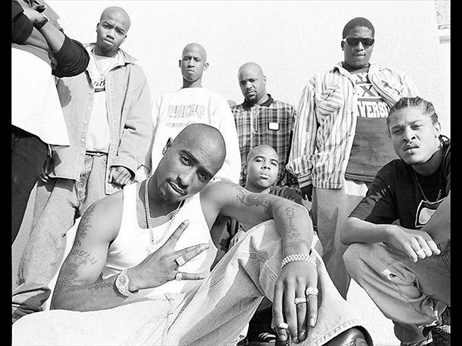

# 《HTML常用标签》

**有人再说“超文本”？那是什么？** 哦，这就是 Web 的基础。

## a 标签

使用 a 标签可以跳转到外部页面、跳转到内部锚点、跳转到邮箱或电话等。

**属性：**

`href`  

通过 `href` 属性创建通向其他网页、文件、同一页面内的位置、电子邮件地址或任何其他 URL 的超链接。可能的取值有：

- `https://google.com`
- `http://google.com`
- `//google.com`：无协议的网址，自动选择用 http 还是 https。写网址，就用这一种
- `/a/b/c` 或 `a/b/c`
- `index.html` 或 `./index.html`
- `javascript:代码;`：创建什么都不做的 a 标签。因为点击 a 标签会刷新页面，为了不刷新页面，需要加上这一行，并将代码留空
- `mailto:邮箱`
- `tel:手机号`
- `href=#xxx`：跳转到一个指定的标签

`target` 

指定在何处显示连接的资源。可能取值有：

- `_blank`：在新页面打开
- `_top`：在顶层页面打开，配合 iframe 才可以看见效果
- `_parent`：在当前页面的父级页面打开
- `_self`：在当前页面打开
- `window 的 name`：在指定的窗口打开页面
- `iframe 的 name`：在指定的 iframe 中打开

`download` 

此属性指示浏览器下载 URL 而不是导航到它，但是没有良好的支持，尤其是手机浏览器。

`rel=noopener` 

使用 target="_blank" 链接到另一个页面将按照与您的页面相同的进程运行新页面。如果新页面正在执行昂贵的JS，则页面的性能可能会受到影响。要避免这种情况，请使用 rel=noopener。

## table 标签

HTML的 `<table>` 元素表示表格数据 — 即通过二维表表示的信息。允许的内容有：

- 一个可选的 `<caption>` 元素
- 零个或多个 `<colgroup>` 元素
- 一个可选的 `<thead>` 元素
- 下列任意一个：
    - 零个或多个 `<tbody>`
    - 零个或多个 `<tr>`
- 一个可选的 `<tfoot>` 元素

---

`table-layout` 

定义了用于布局表格单元格、行和列的算法。可能的取值有：

- `auto`：调整表格及其单元格的宽度以适合内容
- `fixed`：表格和列的宽度通过表格的宽度来设置

`border-collapse`

决定表格的边框是分开的还是合并的。

`border-spacing`

指定相邻单元格边框之间的距离。

## img 标签

发出 get 请求，展示一张图片。

**属性：**

`src` 

包含你想嵌入的图片的文件路径。

`alt` 

包含一条对图像的文本描述。

`height 和 width` 

这将设置图像应占用的空间，以确保图象被加载之前页面的布局是稳定的。

---

`onload` 

成功加载时触发的事件。

`onerror` 

失败时触发的事件。

`max-width: 100%` 

给元素设置最大宽度。百分比值，以父级块级容器宽度的百分比作为最大宽度。