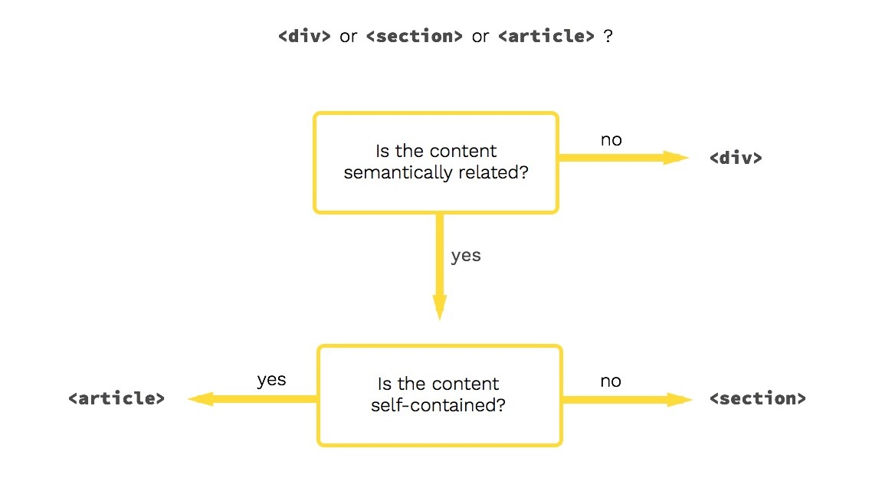

# 《HTML 学习笔记第一篇》


Tim Berners Lee

HTML 是网页使用的语言，由李爵士发明（Tim Berners-Lee）。浏览器访问网站，其实就是从服务器下载 HTML 代码，然后渲染出网页。

## HTML 起手式

```html
<!DOCTYPE html>
<html lang="en">
<head>
  <meta charset="UTF-8">
  <meta http-equiv="X-UA-Compatible" content="IE=edge">
  <meta name="viewport" content="width=device-width, initial-scale=1.0, minimum-scale=1.0, maximum-scale=1.0, user-scalable=no">
  <title>Document</title>
</head>
<body>
  
</body>
</html>
```

`<!DOCTYPE html>`

设置文档类型。

`lang="en"`

设置文档所使用的语言为英文（zh-CN 为中文）。

---

**head 中一般写一些看不见的元素。**

`charset="UTF-8"`

文件的字符编码。

`width=device-width`

将页面宽度设置为跟随设备的屏幕宽度。

`initial-scale=1.0`

设置浏览器首次加载页面时的初始缩放级别。

`minimum-scale=1.0`

定义最小缩放比例。

`maximum-scale=1.0`

定义最大缩放比例。

`user-scalable=no`

禁用缩放。

`http-equiv="X-UA-Compatible" content="ie=edge"`

告诉 IE 使用最新内核。

`<title>`

`<title>` 标签内包含页面的标题。

`感叹号 + Tab`

Emmet语法，直接打出起手式（有缺陷）。

## 常用的章节标签

表示文章的层次。

| 标签        |     说明     |
| ----------- | :----------: |
| `<article>` |     文章     |
| `<h1>~<h6>` |     标题     |
| `<p>`       |     段落     |
| `<section>` |     章节     |
| `<header>`  |     首部     |
| `<footer>`  |     底部     |
| `<main>`    |   主要内容   |
| `<aside>`   |   旁支内容   |
| `<div>`     | 内容划分元素 |
| `<nav>`     |    导航栏    |

## div、section、article 之间的区别

**div：**`<div>`元素是最通用的元素。它没有特殊的含义。其目的是对语义上不相关的内容进行分组。由于它对屏幕阅读器基本上毫无意义，因此应谨慎使用。

**section：**`<section>`元素比`<div>`元素具体一些，表示一个主题性内容分组。因为当`<section>`的内容组合在一起时是有意义的，所以它们应该有一个"主题"。`<section>`的"主题"应该通过在元素中包含标题元素来定义，通常紧跟在开始标记之后。

**article：**`<article>`元素比`<section>`元素更具体，表示页面中一个独立的组成部分，如一个博客帖子、用户论坛帖子或新闻报道。因此它也应当有个标题。

## div or section or article?



## 常用的内容标签

| 标签                 | 说明               |
| -------------------- | :----------------- |
| `<ol> + <li>`        | 有序列表           |
| `<ul> + <li>`        | 无序列表           |
| `<dl> + <dt> + <dd>` | 说明列表           |
| `<pre>`              | 预定义格式文本     |
| `<code>`             | 呈现一段计算机代码 |
| `<hr>`               | 水平分割线         |
| `<br>`               | 换行符号           |
| `<blockquote>`       | 块级引用           |
| `<a>`                | 超链接             |
| `<em>`               | 强调               |
| `<strong>`           | 加粗               |
| `<q>`                | 引用               |

## 全局属性

所有标签都有的属性。

`class`

类。

`contenteditable`

可以使任何一个元素被编辑。

`hidden`

隐藏元素。

`id`

在 CSS 中，通过加 `#` 号被引用加样式。在 JS 中，可以直接通过 `id` 获取对应的元素，但元素里有一些禁忌。

`style`

加样式。

`tabindex`

控制 Tab 的顺序，`0` 代表最后一个访问，`-1` 代表别访问我。

`title`

提示信息。

## 其他

- HTML 属性、CSS、JS 三者同时出现时，以 JS 为最终效果。
- 不到万不得已，千万不要使用 id 属性。
- 在 HTML 中多个连续的空白符只算做一个。