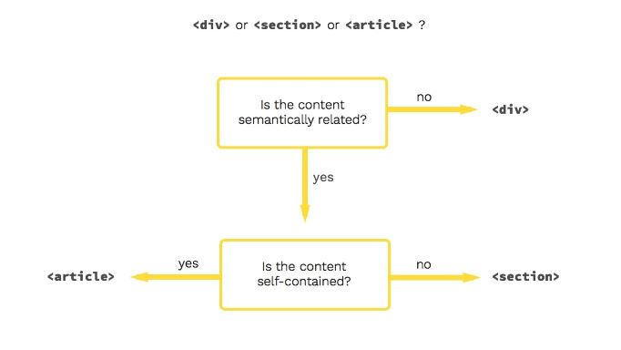

# 《HTML 学习笔记1》


Tim Berners Lee

HTML 是网页使用的语言，由李爵士发明（Tim Berners-Lee）。浏览器访问网站，其实就是从服务器下载 HTML 代码，然后渲染出网页。

## HTML 起手式

```html
<!DOCTYPE html>
<html lang="en">
<head>
  <meta charset="UTF-8">
  <meta http-equiv="X-UA-Compatible" content="IE=edge">
  <meta name="viewport" content="width=device-width, initial-scale=1.0">
  <title>Document</title>
</head>
<body>
  
</body>
</html>
```

- `<!DOCTYPE html>` — 文档类型
- `lang="en"` — 设置文档所使用的语言为英文（zh-CN 为中文）

**head 中一般写一些看不见的元素。**

- `charset="UTF-8"` — 文件的字符编码
- `width=device-width` —  将页面宽度设置为跟随设备的屏幕宽度
- `initial-scale=1.0` — 设置浏览器首次加载页面时的初始缩放级别
- `http-equiv="X-UA-Compatible" content="ie=edge"` — 告诉 IE 使用最新内核
- `<title>` — 页面的标题
- `Emmet 感叹号` — 直接打出起手式

## 常用的章节标签

表示文章的层次。

1. `<article>` — 文章
2. `<h1>~<h6>` — 标题
3. `<p>` — 段落
4. `<section>` — 章节
5. `<header>` — 首部
6. `<footer>` — 底部
7. `<main>` — 主要内容
8. `<aside>` — 旁支内容，包含的内容是对页面内容的补充，如插图或边栏
9. `<div>` — 内容划分元素
10. `<nav>` — 所包含的内容将作为页面的导航链接

## div、section、article 之间的区别

**div：**`<div>`元素是最通用的元素。它没有特殊的含义。其目的是对语义上不相关的内容进行分组。由于它对屏幕阅读器基本上毫无意义，因此应谨慎使用。

**section：**`<section>`元素比`<div>`元素具体一些，表示一个主题性内容分组。因为当`<section>`的内容组合在一起时是有意义的，所以它们应该有一个"主题"。`<section>`的"主题"应该通过在元素中包含标题元素来定义，通常紧跟在开始标记之后。

**article：**`<article>`元素比`<section>`元素更具体，表示页面中一个独立的组成部分，如一个博客帖子、用户论坛帖子或新闻报道。因此它也应当有个标题。

## div or section or article?



## 常用的内容标签

1. `<ol> + <li>` — ordered list + list item，有序列表
2. `<ul> + <li>` — unordered list + list item，无序列表
3. `<dl> + <dt> + <dd>` — description list + term + data，说明列表
4. `<pre>` — preview，预定义格式文本
5. `<hr>` — 水平分割线
6. `<br>` — break，在文本中生成一个换行符号
7. `<a>` — anchor，插入超链接。如果不以 `http` 开头，就会使用当前域名
8. `<em>` — emphasis，强调
9. `<strong>` — 加粗
10. `<code>` — code 标签中的字是等宽的，常与 `pre` 标签一起使用
11. `<q>` —  quote，引用
12. `<blockquote>` — 块级引用

## 全局属性

所有标签都有的属性。

- `class` — 类
- `contenteditable` — 可以使任何一个元素被编辑
- `hidden` — 隐藏元素
- `id` — 在 CSS 中，通过加 `#` 号被引用加样式。在 JS 中，可以直接通过 `id` 获取对应的元素，但元素里有一些禁忌
- `style` — 加样式
- `tabindex` — 控制 Tab 的顺序，`0` 代表最后一个访问，`-1` 代表别访问我
- `title` — 提示信息

## 其他

- HTML 属性、CSS、JS 三者同时出现时，以 JS 为最终效果
- 不到万不得已，千万不要使用 id 属性
- 在 HTML 中多个连续的空白符只算做一个