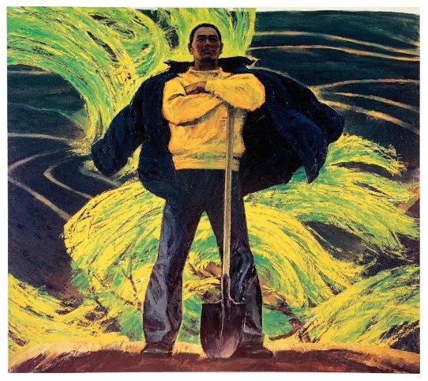

# JavaScript 基本概念



## 语句

语句（Statement）是为了完成某种任务而进行的操作，比如以下就是一行赋值语句：

```JavaScript
let a = 6 + 1;
```

## 表达式

表达式（Expression），指一个为了得到返回值的计算式。比如：

```
6 + 1
```

凡是 JavaScript 语言中预期为值的地方，都可以使用表达式。比如赋值语句的等号右边，预期是一个值，因此可以放置各种表达式。

## 标识符的规则

第一个字符，可以是 Unicode 字母或 `$` 或 `_` 或中文，后面的字符，除了前面所说的，还可以有数字。

## if 语句

大多数编程语言中最为常用的一个语句就是 `if` 语句。以下是 `if` 语句的语法：

```JavaScript
if (condition) statement1 else statement2
```
其中 condition（条件）可以是任意表达式；而且这个表达式求值的结果不一定是布尔值。ECMAScript 会自动调用 `Boolean()` 转换函数将这个表达式的结果转换为一个布尔值。如果对 condition 求值的结果是 `true`，则执行 statement1（语句1），如果 对 condition 求值的结果是 `false`，则执行 statement2（语句2）。而且这个语句既可以是一行代码，也可以是一个代码块（以一对花括号括起来的多行代码）。

## while 语句

`while` 语句属于前测试循环语句，也就是说，在循环体内的代码被执行之前，就会对出口条件求值。因此，循环体内的代码有可能永远不会被执行。以下是 `while` 语句的语法：

```JavaScript
while(expression) statement
```

## for 语句

`for` 语句也是一种前测试循环语句，但它具有在执行循环之前初始化变量和定义循环后要执行的代码的能力。以下是 `for` 语句的语法：

```JavaScript
for (initialization; expression; post-loop-expression) statement
```

## label

使用 `label` 语句可以在代码中添加标签，以便将来使用。以下是 `label` 语句的语法：

```JavaScript
label: statement
```

加标签的语句一般都要与 `for` 语句等循环语句配合使用。

## break 和 continue 语句

`break` 和 `continue` 语句用于在循环中精确的控制代码的执行。其中，`break` 语句会立即退出循环，强制继续执行循环后面的语句。而 `continue` 语句虽然也是立即退出循环，但退出循环后会从循环的顶部继续执行。

`break` 和 `continue` 语句都可以与 `label` 语句联合使用，从而返回代码中特点的位置。这种联合使用的情况多发生在循环嵌套的情况下，比如：

```JavaScript
let num = 0;

outermost:
for (let i=0; i < 10; i++) {
    for (let j=0; j < 10; j++) {
        if (i === 5 && j === 5) {
            break outermost;
        }
        num ++;
    }
}

alert(num); //55
```