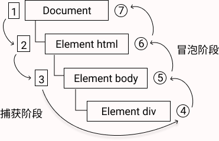

# DOM 事件和事件委托


JavaScript 与 HTML 之间的交互是通过事件实现的。事件，就是文档或浏览器窗口中发生的一些特定的交互瞬间。可以使用侦听器（或处理程序）来预定事件，以便事件发生时执行相应的代码。

## 事件流

当浏览器发展到第四代时 （IE4 及 Netscape Communicator 4），浏览器开发团队遇到了一个很有意思的问题：页面的那一部分会拥有某个特定的事件？要明白这个问题问的是什么，可以想象画在一张纸上的一组同心圆。如果你把手指放在圆心上，那么你的手指指向的不是一个圆，而是纸上的所有圆。两家公司的浏览器开发团队在看待浏览器事件方面还是一致的。如果你单击了某个按钮，他们都认为单击事件不仅仅发生在按钮上。换句话说，在点击按钮的同时，你也单击了按钮的容器元素，甚至也单击了整个页面

事件流描述的是从页面中接受事件的顺序。但有意思的是，IE 和 Netscape 开发团队居然提出了差不多是完全相反的事件流的概念。IE 的事件流是事件冒泡流，而 Netscape Communicator 的事件流是事件捕获流。

## 事件冒泡

IE 的事件流叫做事件冒泡（event bubbling），即事件开始时由最具体的元素（文档中嵌套层次最深的那个节点）接收，然后逐级向上传播到较为不具体的节点（文档）。所有现代浏览器都支持事件冒泡。

## 事件捕获

Netscape Communicator 团队提出另一种事件流叫做事件捕获（event capturing）。事件捕获的意思是不太具体的节点应该更早接收到事件，而具体的节点应该最后接收到事件。事件捕获的用意在于在事件到达预定目标之前捕获它。


## DOM 事件流

“DOM2级事件”规定的事件流包括三个阶段：事件捕获阶段、处于目标阶段和事件冒泡阶段。首先发生的是事件捕获，为截获事件提供了机会。然后是实际的目标接收到事件。最后一个阶段是冒泡阶段，可以在这个阶段对事件做出响应。以一个简单的 HTML 页面为例，单击`<div>`元素会按照如下图所示顺序触发事件。



在 DOM 事件流中，实际的目标（`<div>`元素）在捕获阶段不会接收到事件。这意味着在捕获阶段，事件从 document 到 `<html>` 再到 `<body>` 后就停止了。下一个阶段是“处于目标”阶段，于是事件在`<div>`上发生，并在事件处理中被看成冒泡阶段的一部分。然后，冒泡阶段发生，事件又传播回文档。

多数支持 DOM 事件流的浏览器都实现了一种特定的行为：即使“DOM2级事件”规范明确要求捕获阶段不会涉及事件目标，但 IE9、Safari、Chrome、Firefox和Opera9.5及更高版本都会在捕获阶段触发事件对象上的事件。结果，就是有两个机会在目标对象上面操作事件。

## 事件委托

对“事件处理程序过多”问题的解决方案就是事件委托。事件委托利用了事件冒泡，只指定一个事件处理程序，就可以管理某一类型的所有事件。例如，click 事件会一直冒泡到 document 层次。也就是说，我们可以为整个页面指定一个 onclick 事件处理程序，而不必给每个可单击的元素分别添加事件处理程序。

## 封装事件委托

```javascript
function on(eventType, element, selector, fn) {
	if (!(element instanceof Element)) {
		element = document.querySelector(element)
	}
	element.addEventListener(eventType, (e) => {
		let t=e.target
		while (!t.matches(selector)) {
			if (element === t) {
				t = null
				break
			}
			t = t.parentNode
		}
		t && fn.call(t, e, t)
	})
}
```