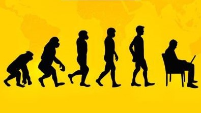

# JavaScript 简介

在人们普遍使用电话拨号上网的时代，能够在客户端完成一些基本的验证任务绝对是令人兴奋的。1995 年 JavaScript 诞生。当时，它的主要目的是处理以前由服务器端语言负责的一些输入验证操作。

自此之后，JavaScript 逐渐成为市面上常见浏览器必备的一项特色功能。如今，JavaScript 的用途早已不再局限于简单的数据验证，而是具备了与浏览器窗口及其内容等几乎所有方面交互的能力。

JavaScript 从一个简单的输入验证器发展成为一门强大的编程语言，完全出乎人们的意料。应该说，它既是一门非常简单的语言，又是一门非常复杂的语言。说它简单，是因为学会使用它只需片刻功夫；而说它复杂，是由为要真正掌握它则需要数年时间。

## JavaScript 简史
1995 年，当时就职于 Netscape 公司的布兰登·艾奇（Brendan Eich)，开始着手为计划于 2 月发布的 Netscape Navigator 2 开发一种名为 LiveScript 的脚本语言 —— 该语言将同时在浏览器和服务器中使用（它在服务器上的名字叫 LiveWire)。为了赶在发布日期前完成 Live Script 的开发，Netscape 与 Sun 公司建立了一个开发联盟。在 Netscape Navigator 2 正式发布前夕，Netscape 为了搭上媒体热炒 Java 的顺风车，临时把 LiveScript 改名为 JavaScript。

## JavaScript 实现
虽然 JavaScript 和 ECMAScript 通常都被人们用来表达相同的含义，但 JavaScript 的含义却比 ECMA-262 中规定的多得多。一个完整的 JavaScript 实现应该由下列三个不同的部分组成。
* 核心（ECMAScript)
* 文档对象模型（DOM)
* 浏览器对象模型（BOM）

## ECMAScript
由 ECMA-262 定义的 ECMAScript 与 Web 浏览器没有依赖关系。实际上，这门语言本身并不包含输入和输出的定义。ECMA-262 定义的只是这门语言的基础，而在此基础之上可以构建更完善的脚本语言。我们常见的 Web 浏览器只是 ECMAScript 实现可能的宿主环境之一。

既然 ECMA-262 标准没有参照 Web 浏览器，那它都规定了些什么内容呢？大致说来，它规定了这门语言的下列组成部分：
* 语法
* 类型
* 语句
* 关键字
* 保留字
* 操作符
* 对象

ECMAScript 就是对实现该标准规定的各个方面内容的语言描述。JavaScript 实现了 ECMAScript。