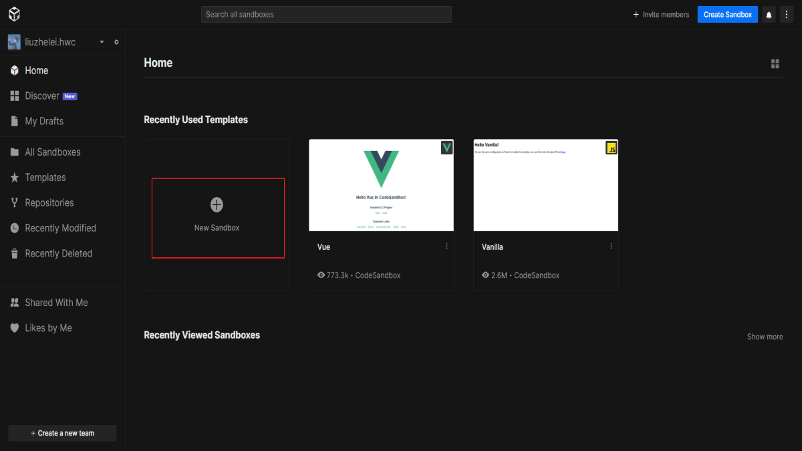
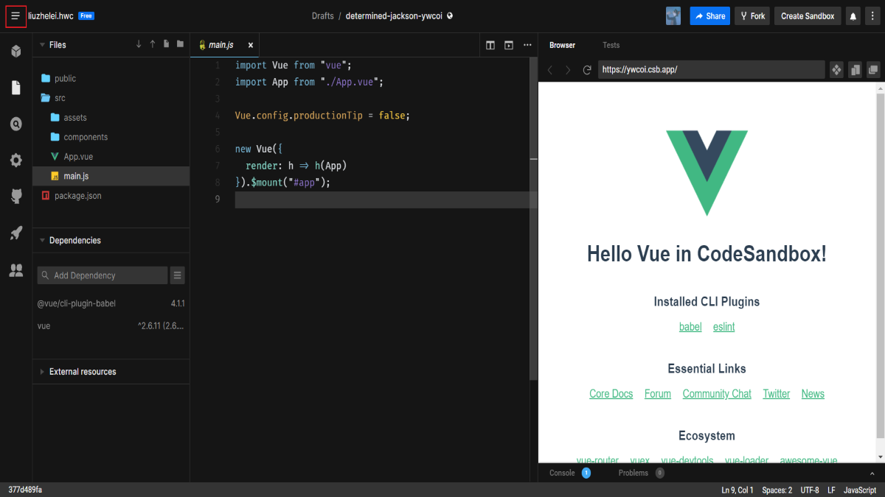

# Vue 入门


## 两个版本对应的文件名

|                            | UMD                | CommonJS              | ES Module（基于构建工具使用） | ES Module（直接用于浏览器） |
| -------------------------- | ------------------ | --------------------- | ----------------------------- | --------------------------- |
| 完整版                     | vue.js             | vue.common.js         | vue.esm.js                    | vue.esm.browser.js          |
| 只包含运行时版             | vue.runtime.js     | vue.runtime.common.js | vue.runtime.esm.js            | -                           |
| 完整版（生产环境）         | vue.min.js         | -                     | -                             | vue.esm.browser.min.js      |
| 只包含运行时版（生产环境） | vue.runtime.min.js | -                     | -                             | -                           |

**术语**

- **完整版：** 同时包含编译器和运行时的版本。
- **编译器：** 用来将模板字符串编译成 JavaScrip 渲染函数的代码。
- **运行时：** 基本上就是除去编译器的其它一切。
- **UMD：** UMD 版本可以通过 `<script>` 标签直接用在浏览器中。
- **CommonJS：** CommonJS 版本用来配合老的打包工具比如 Browserify 或者 webpack1。这些打包工具的默认文件（`pkg.main`）是只包含运行时的 CommonJS 版本（`vue.runtime.common.js`）。
- **ES Module：** 从 2.6 开始 Vue 会提供 两个 ES Modules(ESM)构建文件：

  - 为打包工具提供的 ESM：为诸如 webpack2 或 Rollup 提供的现代打包工具。ESM 格式被设计为可以被静态分析，所以打包工具可以利用这一点来进行“tree-shaking”并将用不到的代码排除出最终的包。为这些打包工具提供的默认文件（`pkg.module`）是只有运行时的 ES Module 构建（`vue.runtime.esm.js`）。
  - 为浏览器提供的 ESM（2.6+）：用来在现代浏览器中通过 `<script type="module">` 直接导入。

- **.min.js 后缀：** 表示去掉注释压缩后的版本

## 两个版本的使用方法

### 直接用 `<script>` 引入

直接下载并用 `<script>` 标签引入，`Vue` 会被注册为一个全局变量。

对于制作原型或学习，你可以这样使用 vue2：

```html
<script src="https://cdnjs.cloudflare.com/ajax/libs/vue/2.6.13/vue.js"></script>
```

对于生产环境，可以这样使用:

```html
<script src="https://cdnjs.cloudflare.com/ajax/libs/vue/2.6.13/vue.min.js"></script>
```

### NPM(or YARN)

在用 Vue 构建大型应用时推荐使用 NPM 安装。NPM 能很好地和诸如 webpack 或 Browserify 模块打包器配合使用。同时 Vue 也提供配套工具来开发单文件组件。

```shell
# 最新稳定版
$ npm install vue

# 也可以使用 YARN
$ yarn add vue
```

### 命令行工具（CLI）

Vue 提供了一个官方的 CLI，为单页面引用（SPA）快速搭建繁杂的脚手架。它为现代前端工作流提供了开箱即用的构建设置。只需要几分钟的时间就可以运行起来并带有热重载、保存时 lint 校验，以及生产环境可用的构建版本。

@vue/cli 用法

1. 全局安装：`yarn global add @vue/cli`
2. 创建目录：`vue create` 路径（路径可以用 `.`）
3. 选择使用哪些配置
4. 用 WebStorm 或 VSCode 打开项目开始 CRM！

## 使用 codesandbox.io 写 Vue 代码


1. 打开 Chrome 浏览器，在搜索框中输入 codesandbox.io 并回车。



2. 点击上图中的 New Sandbox，然后选择 Vue。



3. 开始 CRM!（或者点击上图的 **hamburger menu**，在弹出的菜单中选择 **File** => **Export to Zip**。下载完成后，对文件进行解压，然后用你喜欢的编辑器如 WebStorm 或 VSCode 打开目录开始 CRM!）

\*CRM 就是 Copy Run Modify（学会它，即可独步江湖）

## 完整版和运行时版到底区别在哪？

|               | Vue 完整版                         | Vue 非完整版                      | 评价                               |
| ------------- | ---------------------------------- | --------------------------------- | ---------------------------------- |
| 特点          | 有 compiler                        | 没有 compiler                     | compiler 占 40%体积                |
| 视图          | 写在 HTML 里或者写在 template 选项 | 写在 render 函数里用 h 来创建标签 | h 是尤雨溪写好传给 render 的       |
| cdn 引入      | vue.js                             | vue.runtime.js                    | 文件名不同，生产环境后缀为 .min.js |
| webpack 引入  | 需要配置 alias                     | 默认使用此版                      | 尤雨溪配置的                       |
| @vue/cli 引入 | 需要额外配置                       | 默认使用此版                      | 尤雨溪、蒋豪群配置的               |

最佳实践：总是使用非完整版，然后配合 vue-loader 和 vue 文件。

思路：

1. 保证用户体验，用户下载的 JS 文件体积更小，但只支持 h 函数。
2. 保证开发体验，开发者可直接在 vue 文件里 写 HTML 标签，而不写 h 函数。
3. 脏活让 loader 做，vue-loader 把 vue 文件里的 HTML 转为 h 函数。

render 函数里的 h 用法

```jsx
new Vue({
  el: "#app",
  render(h) {
    return h("div", [this.n, h("button", { on: { click: this.add } }, "+1")]);
  },
  data: {
    // 当使用 vue-loader 时，只能使用函数
    n: 0,
  },
  methods: {
    add() {
      this.n += 1;
    },
  },
});
```

非完整版的意义在于它更加地独立。

## 应用错了会怎样

vue.js 错用成了 vue.runtime.js：无法将 HTML 编译成视图。

vue.runtime.js 错用成 vue.js：代码体积变大，因为 vue.js 有编译 HTML 的功能。

## Template

一个字符串模块作为 Vue 实例的标识使用。模板将会**替换**挂载的元素。挂载元素的内容都将被忽略，除非模板的内容有分发插槽。

如果以 `#` 开始则它将被用作选择符，并使用匹配元素的 innerHTML 作为模板。常用的技巧是用 `<script type="x-template">` 包含模板。

如果你需要在客户端编译模板（比如传入一个字符串给 `template` 选项，或挂载到一个元素上并以其 DOM 内部的 HTML 作为模板），就将需要加上编译器，即完整版：

```jsx
// 需要编译器
new Vue({
  template:`<div>{{ hi }}</div>`

// 不需要编译器
new Vue({
  render(h){
    return h('div', this.hi)
  }
})
```

当使用 `vue-loader` 或 `vueify` 的时候，`*.vue` 文件内部的模板会在构建时预编译成 javaScript。你在最终打好的包里实际上是不需要编译器的，所以只用运行时版本即可。

## Render

字符串模板的代替方案，允许你发挥 JavaScript 最大的编程能力。该渲染函数接收一个 `createElement` 方法作为第一个参数用来创建 VNode。

如果组件是一个函数组件，渲染函数还会接收一个额外的 `context` 参数，为没有实例的函数组件提供上下文信息。

<aside>
💡 Vue 选项中的 render 函数若存在，则 Vue 构造函数不会从 template 选项或通过 el 选项指定的挂载元素中提取出的 HTML 模板编译渲染函数。

</aside>
