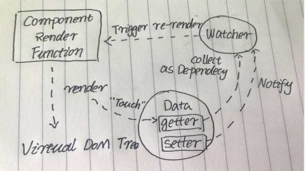

# Vue 数据响应式



当你把一个普通的 JavaScript 对象传入 Vue 实例作为 `data` 选项，Vue 将遍历此对象所有的 property，并使用 `Object.definedProperty` 把这些 property 全部转为 getter/setter。整个过程大致如以下代码所示：

```jsx
let myData = {n: 0}
let vm = proxy({data: myData})

function proxy({data}) {
  const obj = {}
  for (let k in data) {
    let value = data[k]
    Object.defineProperty(data, k, {
      get() {
        return value
      },
      set(newValue) {
        if (newValue < 0) return
        value = newValue
      }
    })
    Object.defineProperty(obj, k, {
      get() {
        return data[k]
      },
      set(value) {
        if (value < 0) return
        data[k] = value
      }
    })

  }
  return obj // obj 就是代理
}

console.log(vm.n) // 0
myData.n = -1
console.log(vm.n) // 0
myData.n = 1
console.log(vm.n) // 1
```

**Object.defineProperty：** 可以给对象添加属性 value，可以给对象添加 getter/setter，getter/setter 用于对属性的读写进行监控。

对 myData 对象的属性读写，全权由另一个对象 vm 负责，那么 vm 就是 myData 的代理，比如 myData.n 不用，偏要用 vm.n 来操作 myData.n。

**vm=new Vue({data:myData})：**

1. 会让 vm 成为 myData 的代理（proxy）
2. 会对 myData 的所有属性进行监控

为什么要监控，为了防止 myData 的属性变了，vm 不知道。vm 知道了又如何？知道属性变了就可以调用 render(data) 呀！UI = render(data)

如果 data 有多个属性 n、m、k，那么就会有 get n / get m / get k 等

## Vue 的 data 是响应式

```jsx
const vm = new Vue({data:{n:0}})
```

我如果修改 vm.n，那么 UI 中的 n 就会响应我，Vue 通过 Object.defineProperty 来实现数据响应式。

## Object.defineProperty 的问题

```jsx
Object.defineProperty(obj,'n',{...})
```

必须要有一个 ‘n’，才能监听 & 代理 obj.n 吧。如果前端开发者比较水，没有给 n 怎么办。

```jsx
import Vue from 'vue/dist/vue.js'

Vue.config.productionTip = false

new Vue({
  data: {
    obj: {
      a: 0 // obj.a 会被 Vue 监听 & 代理
    }
  },
  template: `
    <div>
    {{ obj.b }}
    <button @click="setB">set b</button>
    </div>
  `,
  methods: {
    setB() {
      this.obj.b = 1 // 请问，页面中会显示 1 吗？
    }
  }
}).$mount("#app")
```

此时如果我点击 set b，请问视图中会显示 1 吗？

答案是：不会

为什么：因为 Vue 没法监听一开始不存在的 obj.b

**解决办法**

1. 那我把 key 都声明好，后面不再加属性不就行了
2. 使用 Vue.set 或者 this.$set

## Vue.set 和 this.$set

新增 key，自动创建代理和监听（如果没有创建过）触发 UI 更新（但并不会立刻更新）。例如

```jsx
this.$set(this.object,'m',100)
```

## data 中有数组怎么办？

你没法提前声明所有 key。

```jsx
import Vue from "vue/dist/vue.js";

Vue.config.productionTip = false;

new Vue({
  data: {
    array: ["a", "b", "c"]
  },
  template: `
    <div>
    {{ array }}
    <button @click="setD">set d</button>
    </div>
  `,
  methods: {
    setD() {
      this.array[3] = "d"; //请问，页面中会显示 'd' 吗？
      // 等下，你为什么不用 this.array.push('d')
    }
  }
}).$mount("#app");
```

你看，你没有办法提前把数组的 key 都声明出来。Vue 也不能检测对你新增了下标，难道每次改数组都要用 `Vue.set`、`this.$set` 。

**尤雨溪的做法**

篡改数组的 API，见文档中[变异方法](https://cn.vuejs.org/v2/guide/list.html#s-authing)章节，这 7 个 API都会被 Vue 篡改，调用后会更新 UI。

怎么篡改的？

```jsx
class VueArray extends Array {
  push(...args) {
    const oldLength = this.length // this 就是当前数组
    super.push(...args)
    console.log('你 push 了')
    for (let i = oldLength; i < this.length; i++) {
      Vue.set(this, i, this[i])
      // 将每个新增的 key 都告诉 Vue
    }
  }
}
```

<aside>
⚠️ 这不代表 Vue 的真实实现。

</aside>

## 总结

对象中新增的 key

Vue 没有办法实现监听和代理，要使用 set 来新增 key，创建监听和代理，更新 UI，最好提前把属性都写出来，不要新增 key，但数组做不到“不新增key”

数组中新增的 key

也可用 set 来新增 key，更新 UI。不过尤雨溪篡改了 7 个API 方便你对数组进行增删，这个 7 个 API 会自动处理监听和代理，并更新 UI。

结论：数组新增 key 最好通过 7 个 API。